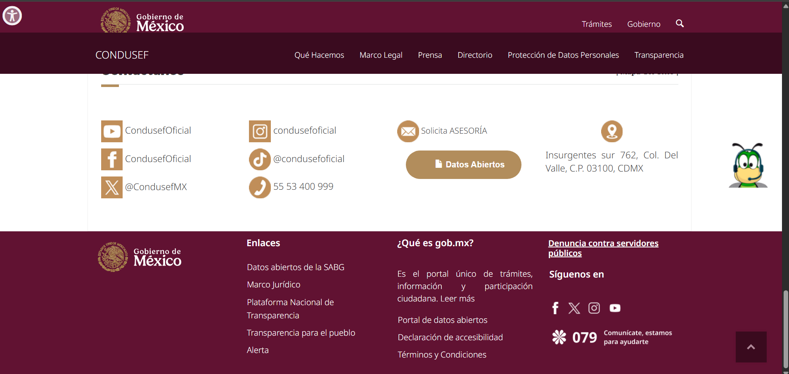
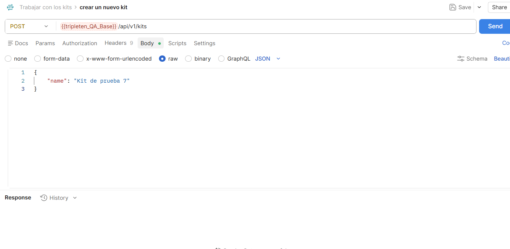
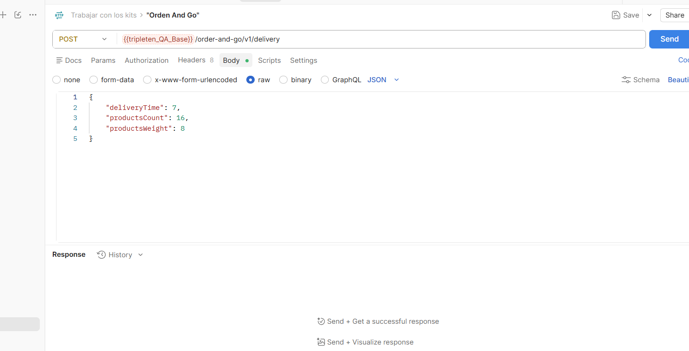

# 🎸 Testing para sitio web del Videojuego "Guitar Flash"

### 🎯 Objetivo
Validar la estabilidad y flujo crítico de Login (Smoke & Exploratory Testing) en entorno productivo.

### 🔧 Proceso de Pruebas
- Diseño de 20+ casos de prueba con matriz de trazabilidad.
- Análisis de comportamiento con Chrome DevTools.
- Documentación de defectos con evidencia.

### 📈 Resultados
- 3 bugs funcionales documentados en campos E-mail y Contraseña.
- Cobertura completa del flujo crítico de autenticación.
____________________________________________________________________________________________________________________________________________________________________________________________________________________
### 🛠️ Tech Stack

| Categoría | Herramientas |
| :--- | :--- |
| **Gestión de Pruebas** |   |
| **Testing** | `Chrome DevTools` `Smoke Testing` `Exploratory Testing` |
| **Soporte** | `ChatGPT` para optimización de cobertura |

**🎮 Videojuego:** [Guitar Flash - XGames](https://guitarflash.com/?lg=es)

**📂 Evidencia:** [🔗 Ver Casos de Prueba y Bugs](https://docs.google.com/spreadsheets/d/1dLoMbH6oAnJuKN3EBxt5fXpu0qszI9onff6ud4zusR0/edit?usp=sharing)
____________________________________________________________________________________________________________________________________________________________________________________________________________________
## Testing Design para la página web "Condusef" (Proyecto propio)
### ¿Qué hice?
● Realicé pruebas exploratorias (Exploratory testing) como primer paso para análisis del sitio web.
Examiné el sitio web en dos navegadores para las pruebas (google chrome y google firefox).
Construí y ejecuté una lista de comprobación para el estudio de la página web en ambos navegadores.
Hice un análisis con ayuda de la inteligencia articial para depurar los escenarios a probar de la página.

### ¿Como lo hice?
● Inicié una meticulosa busqueda de los diseños (Design UI) con la finalidad de mejorar el fluje de trabajo y acelerar el análisis.
Documenté la lista de comprobación con colores frescos y de fácil visualización, así también una estructura sólida.
Refresqué las páginas web en ambos escenarios y supervisé cuidadosamente los navegadores a probar, asegurando la calidad de los diseños. De esta forma, aceleré las pruebas en un 15%

### ¿Qué logré?
● Fortalecí mis conocimientos en QA para análisis de diseño, alcanzando un nuevo hito en mi profesión de forma autónoma.
Gestioné rigurosamente los diseños y aseguré la calidad de la interfaz para ambos navegadores, perfeccionando la experiencia del usuario.
Conseguí realizar un reporte de bug en jira, aplicando mis conocimientos en pruebas de diseño UI para este proyecto, perfeccionando la experiencia del usuario.
En conclusión: La página presentaba múltiples defectos visuales hace unos años, y poder inspeccionarla fué una gran experiencia poner a prueba mis habilidades en pruebas de humo, regresión y exploratorias. De manera similar, gané más confianza en mis conocimientos en Design UI.
### Herramientas
:bug: JIRA

:computer: EXCEL

:gear: IA CHATGPT

:bookmark_tabs: DEVTOOLS (GOOGLE CHROME Y FIREFOX)

Página Condusef Oficial:

  
  
  

#### Enlace al Proyecto: https://docs.google.com/spreadsheets/d/14F2KkiefHC7NZCgrfLGfHaeiqM2ncOzTBclDjuJVirc/edit?usp=sharing
____________________________________________________________________________________________________________________________________________________________________________________________________________________
## Api testing para la aplicación "Urban Grocers"
### ¿Qué hice?
● Comencé gestionando los requisitos del back-end en la documentación de la Api (ApiDoc). con la finalidad de conocer mejor el producto.
Hice una investigación completa en pruebas de humo (Smoke testing) para los límites de prueba a realizar, obteniendo más confianza y seguridad.
Todo esto con la certeza de hacer una mejor revisión de la calidad del producto en las Apis correspondientes.

### ¿Como lo hice?
● Utilicé la fuente principal de información de las apis en Api Doc (Requisitos del back-end) ya antes mencionada.
A través de POSTMAN, realicé consultas en metodos Post (Creación de usuario) Get (Solitar información) y Pacth (Actualizar información) para las solicitudes del back-end y sus respectivos Endpoints.
Con la conclusión de acelerar el rendimiento del trabajo, hice un seguimiento sólido para los endpoints a probar.
Con la ayuda de Excel, documenté casos de prueba para los distintos escenarios para la evaluación de las Apis.
En Jira gestioné un seguimiento de informe de errores bien estruturado y fácil de entender, de esta forma garanticé una investigación propia para los defectos.

### ¿Qué logre?
● Encontré 26 errores en los endpoints, especialmente en los metodos GET (request) a través de los límites solicitados en la documentación de las Apis.
Conseguí realizar una mejor agilidad en el flujo de trabajo utilizando la herramienta POSTMAN. perfeccioné mis habilidades en el uso de los metodos.
Mejoré la calidad y la función principal de las Apis, por medio de JIRA, logré obtener un seguimiento de defectos adecuado y prioricé la clasificación de cada error encontrado.
En conclusión: Al principio las Apis eran otro mundo para mí, ahora hacer este proyecto fue una invitación directa a relacionarme a él. Con gran satisfacción puedo avalar mi aprendizaje en pruebas manuales. Después de comprenderlo, ayude a otros compañeros a conocerlas mejor; entonces también fortalecí mi liderazgo como compañero QA, ofreciendo empatía y confiabilidad.
### Herramientas
:rocket: POSTMAN                                                                                      

:bug: JIRA

:computer: EXCEL

:books: Documentos ApiDoc

:file_folder: Metodos: POST - GET - PATCH

Prueba de Apis:

  
  
  

#### Enlace al Proyecto: https://docs.google.com/spreadsheets/d/1KE0OSKe0jPPCd9U9E_iFZQaPvFzjQkmzlwe7pa1Hp9Y/edit?usp=sharing
___________________________________________________________________________________________________________________________________________________________________________________________________________________

## ESTUDIOS Y LICENCIATURAS

#### :book: LICENICIATURA EN ARQUITECTURA - Universidad Juárez Autónoma de Tabasco (UJAT) 2018-2021 (Trunca)

#### :book: CERTIFICACIÓN EN QA ENGINEER - TripleTen LATAM Ene/Jul-2026 (Finalizado)
___________________________________________________________________________________________________________________________________________________________________________________________________________________

## IDIOMAS

#### 🌎 Español Nivel: Nativo

#### 🌎 Inglés Nivel: A2 Básico
___________________________________________________________________________________________________________________________________________________________________________________________________________________

## CONTACTOS

#### 👤LINKEDIN: www.linkedin.com/in/gerardo-vargas-ventura1999
#### 💼MI CV: https://docs.google.com/document/d/1rs67FOnQMgbaalxX0pwpU8pGn02bhh8Y/edit?usp=sharing&ouid=116880271726901642696&rtpof=true&sd=true
